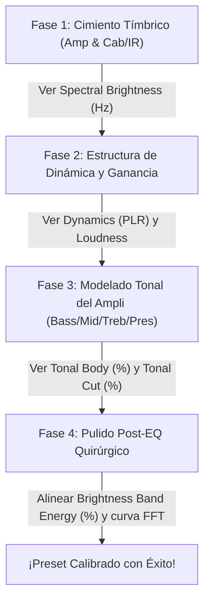

# Guía de Calibración de Tono en Line 6 Helix con MondoHelixAnalyzer

Esta guía práctica describe el proceso paso a paso para calibrar cualquier preset en tu procesador **Line 6 Helix** (tanto en hardware físico como en *Helix Native*) utilizando la suite de diagnóstico científico **MondoHelixAnalyzer**. 

Al correlacionar los parámetros del software de la Helix con las métricas en tiempo real de nuestra aplicación, eliminarás las conjeturas y podrás moldear tonos de guitarra profesionales, consistentes y listos para cualquier mezcla o escenario.

---

## 1. Mapa de Referencia: Controles de Helix vs. Métricas del Analizador

Para realizar una calibración exitosa, es fundamental entender qué perilla física o bloque dentro de la Helix afecta directamente a cada medidor de la aplicación:

| Control en Line 6 Helix | Métrica Afectada en el Analizador | Rango Objetivo Estándar |
| :--- | :--- | :--- |
| **Gain / Drive** (Ampli) & **Compressors** | **DYNAMICS (PLR)** | **8.0 a 12.0 PLR** (Rítmica/Lead) **12.0 a 15.0 PLR** (Ambient/Limpio) |
| **Channel Volume** (Ampli) | **LOUDNESS (INTEGRATED)** | **-18.0 a -14.0 LUFS** (Zona Verde) |
| **Microphone Type & Distance** (Cab/IR) | **SPECTRAL BRIGHTNESS (Hz)** | **1000 Hz a 2500 Hz** (Tonalidad General) |
| **Bass & Depth / Sag** (Ampli) | **TONAL BODY (%)** (100 Hz - 500 Hz) | **20% a 45%** (Según perfil) |
| **Treble & Presence** (Ampli) | **TONAL CUT (%)** (2 kHz - 5 kHz) | **15% a 50%** (Según perfil) |
| **Parametric EQ** (Boosts/Cuts post-ampli) | **BRIGHTNESS BAND ENERGY (%)** | **15% a 60%** (Bandas dinámicas de brillo) |

---

## 2. El Proceso de Calibración en 4 Fases

Sigue este orden secuencial para modelar tu preset de manera estructurada:

### Fase 1: Cimiento Tímbrico (Selección de Amp y Cab/IR)
El 80% de tu firma tímbrica se define en esta fase. No intentes ecualizar un amplificador o un gabinete que por naturaleza física no se adaptan al sonido que buscas.

1.  **Selecciona el modelo de Amplificador e IR** que representen el carácter base (ej. *Placater Clean* para limpios sedosos, *Brit Plexi* para crunch setentero, *Badonk* para metal moderno).
2.  **Configura el micrófono en el gabinete (Cab/IR):**
    *   **Si el tono está muy chillón o estridente** (la métrica **Spectral Brightness** marca más de `2500 Hz`): Cambia el micrófono a uno de cinta como el **121 Ribbon** o aleja el micrófono dinámico actual del cono (`Distance` de 2.0" a 4.0").
    *   **Si el tono está muy oscuro, opaco o apagado** (el Brillo marca menos de `1000 Hz`): Selecciona un micrófono dinámico brillante como el **57 Dynamic** o el **409 Dynamic**, y acércalo al cono (`Distance` de 1.0" a 1.5").

---

### Fase 2: Estructura de Dinámica y Ganancia (El "Feel" y Nivelación)
La dinámica es el comportamiento táctil del preset. La ganancia comprime la señal de forma natural, reduciendo el rango dinámico.

1.  **Ajusta el Gain/Drive:** Toca tu guitarra (o reproduce tu archivo DI en loop) y observa la métrica **DYNAMICS (PLR)**.
    *   *Guitarra Rítmica de Distorsión:* Incrementa el Gain del ampli hasta el punto de saturación deseado. Busca que la métrica de PLR se estabilice en la zona de **8.0 a 11.0 PLR**.
    *   *Guitarra Limpia o Ambient:* Si usas un compresor al inicio (como el *Deluxe Comp* o *Red Squeeze*), ajusta el control de `Threshold` y `Mix` para que el PLR no baje de **12.0 PLR**, manteniendo la dinámica expresiva del preset.
2.  **Nivelación de Volumen:** Observa el medidor **LOUDNESS (INTEGRATED)**. 
    *   Mueve la perilla de **Channel Volume** del bloque de amplificador de la Helix hacia arriba o hacia abajo hasta que la lectura del analizador se posicione firmemente dentro de la **zona óptima (verde)** del perfil activo (típicamente entre `-18.0 LUFS` y `-14.0 LUFS`).
    *   > [!IMPORTANT]
        > **¡Nunca uses la perilla Master Volume del amplificador ni el control de Gain para ajustar el volumen de salida!** Esos controles modelan la distorsión física y la respuesta armónica de las válvulas de potencia de la Helix, no la ganancia limpia de volumen.

---

### Fase 3: Modelado Tonal del Amplificador (La Balanza del Tono)
Una vez definida la dinámica y la ganancia base, es momento de ajustar la ecualización tonal gruesa utilizando las perillas nativas del amplificador en la Helix.

1.  **Ajuste del Tonal Body (%):** Esta métrica mide la energía concentrada entre `100 Hz y 500 Hz` (graves y medios-graves).
    *   Si tu preset suena **delgado o sin fuerza** (el medidor marca por debajo de su límite óptimo): Sube paulatinamente el control de **Bass** del amplificador. Si el modelo lo incluye, también puedes incrementar ligeramente el parámetro **Depth** (Profundidad).
    *   Si tu preset suena **pastoso o retumbante** (el medidor se va al extremo derecho, zona roja): Disminuye la perilla de **Bass** o reduce el parámetro **Sag** (que emula la compresión y caída de graves de la fuente de alimentación a válvulas).
2.  **Ajuste del Tonal Cut (%) y Spectral Brightness (Hz):** Estas métricas de presencia de agudos (`2 kHz a 5 kHz`) y equilibrio tímbrico general.
    *   Si la guitarra **no se escucha o se pierde en la mezcla** (bajo porcentaje en **Tonal Cut**): Incrementa los potenciómetros de **Treble** y **Presence** en el amplificador para recortar y ganar mordida.
    *   Si la guitarra **raspa el oído o suena muy áspera digitalmente**: Disminuye el **Presence** y compensa subiendo los **Mids** (medios), lo cual redondea la curva espectral y baja el centroide de agudos a una frecuencia más placentera.

---

### Fase 4: Pulido Post-EQ Quirúrgico
Si después de optimizar el amplificador y el gabinete, tus métricas de **Tonal Body (%)**, **Tonal Cut (%)** o **Brightness Band Energy (%)** no logran centrarse perfectamente en la zona verde, o notas que la curva FFT de la app tiene "picos o valles" que difieren de la curva objetivo (línea verde de referencia):

1.  **Añade un bloque "Parametric EQ"** al final de tu cadena de señal en la Helix.
2.  **Corte de Limpieza de Graves (Low Cut):** Configura un filtro paso alto (*Low Cut*) en la propia EQ o en el bloque de IR a **80 Hz o 90 Hz**. Esto removerá inmediatamente la vibración de sub-graves inútil generada por el amplificador que compite con el bajo y el bombo, estabilizando la lectura de tu **Tonal Body (%)**.
3.  **Corte de Brillo Digital (High Cut):** Configura un filtro paso bajo (*High Cut*) en tu bloque de IR o ecualizador final a **8.5 kHz o 9.5 kHz**. Esto limpiará el chirrido digital estridente super agudo, haciendo que tu **Spectral Brightness (Hz)** e indicadores tímbricos se sitúen en valores súper musicales.
4.  **Alineación de la Banda de Brillo (Brightness Band Energy %):**
    *   Si tu preset carece de la vibración aérea o la definición de tu target: Realiza un realce suave de **+1.5 dB a +2.5 dB** con una campana ancha (Q bajo de `0.7` a `1.0`) centrado en la frecuencia objetivo de la app (ej. realzar en `1600 Hz` para Rhythm, o en `2200 Hz` para Lead).
    *   Compara visualmente la curva FFT amarilla de tu preset en la gráfica con la curva verde de referencia hasta que ambas corran de manera paralela.

---

## 3. Secretos de Programación Pro en Line 6 Helix

Para llevar tus presets al siguiente nivel, ten en cuenta estos parámetros ocultos o avanzados de la Helix:

> [!TIP]
> *   **Sag (Ampli):** Controla la caída dinámica del amplificador de potencia. Valores bajos (ej. `2.0` a `3.5`) dan un ataque de púa rápido, seco y con un PLR más limpio y definido (ideal para rítmicas de metal técnico). Valores altos (ej. `5.5` a `7.0`) dan un tono esponjoso y comprimido de blues con más sustain.
> *   **Bias & Bias X (Ampli):** Emulan el punto de polarización de las válvulas de potencia. Subir el Bias aumenta los armónicos cálidos de graves y medios, incrementando el **Tonal Body (%)** y suavizando la distorsión, haciéndola menos estridente.
> *   **La opción "High Cut" integrada en las Cabs:** Los gabinetes de fábrica de la Helix por defecto vienen sin filtro de paso bajo (a `20.0 kHz`). **Siempre** reduce este parámetro entre `8.0 kHz y 10.0 kHz` para conseguir un sonido orgánico de amplificador real capturado en estudio profesional.
